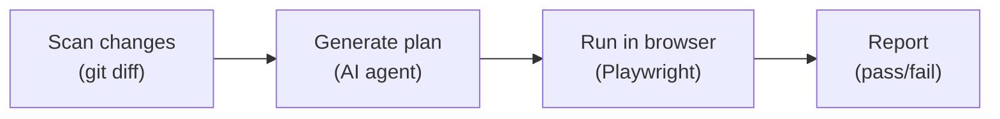

#  Expect

[](https://npmjs.com/package/expect-cli)
[](https://npmjs.com/package/expect-cli)

Let agents test your code in a real browser.

One command scans your unstaged changes or branch diff, generates a test plan, and runs it against a live browser.

### **[See it in action →](https://expect.dev)**

<a href="https://expect.dev"></a>

## Install

```bash
npx -y expect-cli@latest init
```

## Usage

```
Usage: expect-cli [options] [command]

Options:
  -m, --message <instruction>   natural language instruction for what to test
  -f, --flow <slug>             reuse a saved flow by slug
  -y, --yes                     skip plan review, run immediately
  -a, --agent <provider>        agent provider to use (claude, codex, copilot, gemini, cursor, opencode, or droid)
  -t, --target <target>         what to test: unstaged, branch, or changes (default: changes)
  --verbose                     enable verbose logging
  -v, --version                 print version
  -h, --help                    display help

Commands:
  init                          install expect globally and set up skill

Examples:
  $ expect-cli                                          open interactive TUI
  $ expect-cli -m "test the login flow" -y              plan and run immediately
  $ expect-cli --target branch                          test all branch changes
  $ expect-cli --target unstaged                        test unstaged changes

Set `NO_TELEMETRY=1` to disable analytics events.
```

## How it works



Expect reads your unstaged changes or branch diff, sends them to an AI agent, and generates a step-by-step test plan describing how to validate the changes. You review and approve the plan in an interactive TUI, then the agent executes each step against a live browser - using your real login sessions so there's no manual auth setup. Every session is recorded so you can replay exactly what happened.

Pass `-y` to skip plan review and run headlessly in CI. Exits `0` on success, `1` on failure.

### Why not ...?

Most of these tools let an agent click around a browser. Expect does that too, but it also reads your diff, writes a test plan, runs it with your real cookies across multiple browsers, and gives you a live view + replay of every session.

| Tool                                                                         | What it does                                                                             | Auth                                                      | Browsers                            | Recording               | Diff-aware                                                         | Live view | CI  |
| ---------------------------------------------------------------------------- | ---------------------------------------------------------------------------------------- | --------------------------------------------------------- | ----------------------------------- | ----------------------- | ------------------------------------------------------------------ | --------- | --- |
| **Expect**                                                                   | Reads your diff, generates a test plan, runs it in a real browser                        | Extracts cookies from Chrome/Firefox/Safari profiles      | Multi-browser                       | rrweb replay viewer     | Yes                                                                | Yes       | Yes |
| [Playwright CLI](https://playwright.dev)                                     | Traditional test runner, you write and maintain tests by hand                            | Manual `storageState` JSON                                | Chromium, Firefox, WebKit           | Trace Viewer            | `--only-changed` filters existing tests, doesn't generate new ones | No        | Yes |
| [Playwright MCP](https://github.com/microsoft/playwright-mcp)                | Exposes Playwright as MCP tools, any LLM can drive a browser via accessibility snapshots | None, starts logged out                                   | Chromium only                       | No                      | No                                                                 | No        | Yes |
| [Claude in Chrome](https://code.claude.com/docs/en/chrome)                   | Extension connects Claude Code to your running Chrome                                    | Inherits your browser session                             | Whichever Chrome window you connect | GIF only                | No                                                                 | No        | No  |
| [Playwriter](https://github.com/remorses/playwriter)                         | Extension connects any MCP client to your running Chrome                                 | Inherits your browser session                             | Chrome only (needs extension)       | Video capture           | No                                                                 | No        | No  |
| [Agent Browser](https://github.com/vercel-labs/agent-browser)                | Fast Rust CLI for headless browser automation, supports cloud providers                  | None locally, Kernel cloud profiles                       | Chromium only locally               | No                      | No                                                                 | No        | Yes |
| [Chrome DevTools MCP](https://github.com/ChromeDevTools/chrome-devtools-mcp) | Google's MCP server for DevTools: perf tracing, network inspection, Lighthouse           | None, isolated profile                                    | Chrome only                         | Experimental screencast | No                                                                 | No        | Yes |
| [Dev Browser](https://github.com/SawyerHood/dev-browser)                     | Runs sandboxed JS against Playwright browsers                                            | Can connect to running Chrome, no extraction for headless | Chromium only                       | No                      | No                                                                 | No        | Yes |
| [Playwright `codegen`](https://playwright.dev/docs/codegen)                  | Records your manual clicks and outputs test code you maintain                            | None                                                      | One at a time                       | No                      | No                                                                 | No        | No  |

## Supported Agents

Expect works with the following coding agents via the [Agent Client Protocol (ACP)](https://agentclientprotocol.org):

| Agent                                                         | Flag          | Install                                    |
| ------------------------------------------------------------- | ------------- | ------------------------------------------ |
| [Claude Code](https://docs.anthropic.com/en/docs/claude-code) | `-a claude`   | `npm install -g @anthropic-ai/claude-code` |
| [Codex](https://github.com/openai/codex)                      | `-a codex`    | `npm install -g @openai/codex`             |
| [GitHub Copilot](https://github.com/github/copilot)           | `-a copilot`  | `npm install -g @github/copilot`           |
| [Gemini CLI](https://github.com/google-gemini/gemini-cli)     | `-a gemini`   | `npm install -g @google/gemini-cli`        |
| [Cursor](https://cursor.com)                                  | `-a cursor`   | [cursor.com](https://cursor.com)           |
| [OpenCode](https://github.com/opencode-ai/opencode)           | `-a opencode` | `npm install -g opencode-ai`               |
| [Factory Droid](https://factory.ai)                           | `-a droid`    | `npm install -g droid`                     |

Expect auto-detects which agents are installed on your `PATH`. If multiple are available, it defaults to the first one found. Use `-a <provider>` to pick a specific agent.

## Resources & Contributing Back

Want to try it out? Check out [our demo](https://expect.dev).

Find a bug? Head over to our [issue tracker](https://github.com/millionco/expect/issues) and we'll do our best to help. We love pull requests, too!

We expect all contributors to abide by the terms of our [Code of Conduct](https://github.com/millionco/expect/blob/main/.github/CODE_OF_CONDUCT.md).

[**→ Start contributing on GitHub**](https://github.com/millionco/expect/blob/main/CONTRIBUTING.md)

### License

FSL-1.1-MIT © [Million Software, Inc.](https://million.dev)
